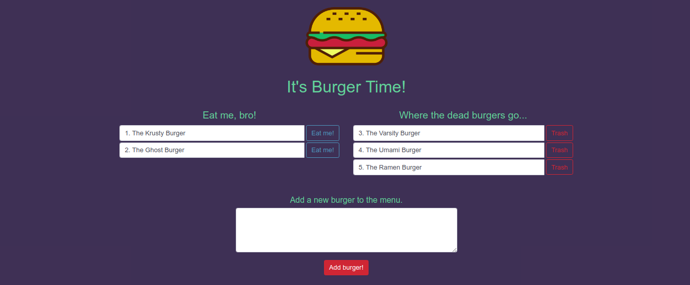

# UTBC_Burger

UTBC_Burger is a a Node.js application that simulates a burger menu.

You can eat, add and remove a burger from the menu with a click of a button.

You can find it hosted on Heroku: https://fast-crag-36657.herokuapp.com/index

Enjoy!
